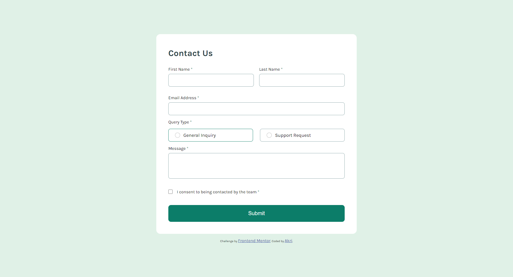

# Frontend Mentor - Contact form solution

This is a solution to the [Contact form challenge on Frontend Mentor](https://www.frontendmentor.io/challenges/contact-form--G-hYlqKJj). Frontend Mentor challenges help you improve your coding skills by building realistic projects. 

## Table of contents

- [Overview](#overview)
  - [The challenge](#the-challenge)
  - [Screenshot](#screenshot)
  - [Links](#links)
- [My process](#my-process)
  - [Built with](#built-with)
  - [What I learned](#what-i-learned)
  - [Continued development](#continued-development)
  - [Useful resources](#useful-resources)
- [Author](#author)

## Overview

### The challenge

Users should be able to:

- Complete the form and see a success toast message upon successful submission
- Receive form validation messages if:
  - A required field has been missed
  - The email address is not formatted correctly
- Complete the form only using their keyboard
- Have inputs, error messages, and the success message announced on their screen reader
- View the optimal layout for the interface depending on their device's screen size
- See hover and focus states for all interactive elements on the page

### Screenshot



### Links

- Live Site URL: [Contact Form](https://akri-dev.github.io/frontend-mentor_contact-form/)

## My process

1. Worked on HTML structure
2. Worked on main functions in Javascript
3. Worked on CSS Layout
4. Adjusted bugs with form validations
5. Polished CSS of Style States
6. Worked on Toast Notification
7. Polished Responsiveness

### Built with

- HTML 5
- CSS custom properties
- Flexbox
- Javascript functions
- Font Awesome 

### What I learned

  - Form Validation
  - DOM manipulation using getElement
  - The document.forms property in JavaScript provides an array-like object containing all the form elements within the current HTML document. Each form element is represented as an object in this array.
  - Getting used to DOM manipulations stored into a variable
  - How to use Regex (or Regular Expressions)

Code that lead me to a Point of Realization:

```js
const form = document.forms["contact_form"];
const fieldValue = form[fieldName];
```

### Continued development

- Refactor code that uses Javascript to make the process much more simpler
- Convert code to OOP and/or Abstraction

### Useful resources

- [Web Development For Beginners by White Belt Mastery](https://www.amazon.com/Web-Development-beginners-Programming-development/dp/B08BWCL2RW) - This helped me for learning the basics of Javascript and DOM Manipulation.

## Author

- Website - [Personal Portfolio](https://akri-dev.github.io/av-portfolio/)
- Frontend Mentor - [@akri-dev](https://www.frontendmentor.io/profile/akri-dev)